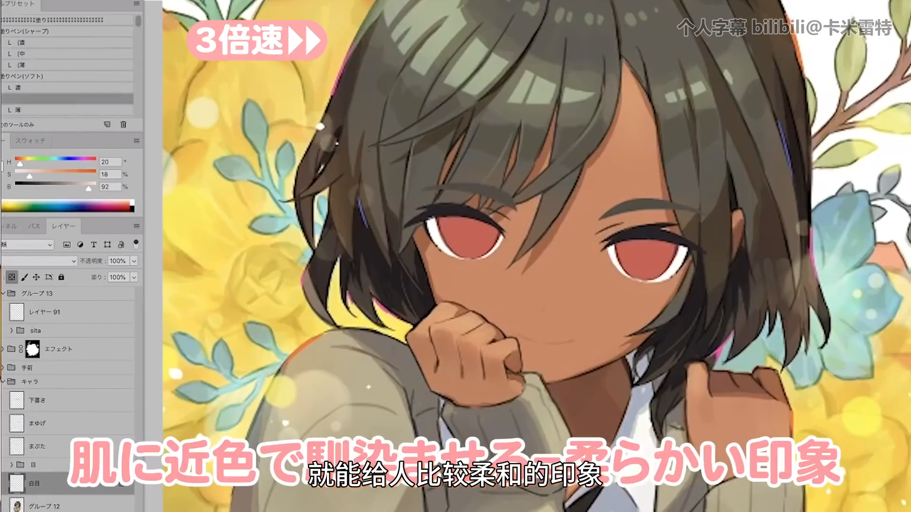

## 草稿篇

最初草草的画一下眼睛的轮廓，把表情的细微差别表现出来，用轻柔的线条大致描绘出来，这个时候如果绘制的太准确的话，可能会让画变得生硬

## 睫毛篇

降低草稿的透明度，开始绘制眼睑和睫毛

如果画的又细又薄的话，眼睛就是柔弱的感觉，反之体现强大，根据人物的性格来调整吧

> 眉毛的颜色使用接近发色的颜色效果会更好哦

## 眼睛篇

接下来先绘制眼黑部分，它的大小和最终印象紧密相关，会影响人物视线的最终方向，为了尽快让自己抓住这个印象，要在早期阶段涂上颜色，同时，在绘制眼白之前绘制眼黑更容易控制眼睛的大小

> 记得给眼睛描线，颜色就用比眼睛颜色更深的颜色

## 眼白篇

接下来绘制眼白，它是决定印象的重要因素

讲眼白的白色部分画得轮廓分明的话，会给人比较精神的感觉，但是太多反而会有种压迫感，适当的混合肤色和灰色，让颜色接近肤色的话

## 阴影篇

之后要绘制从眼睑投射的阴影，如果不画的话，眼睛整体会亮的可怕

有阴影和无阴影的地方颜色差距越大，视线的压迫感就越强，如果上下的颜色差越小，对比度越小的话就能呈现温柔或者弱气的印象

> 记得眼白的部分也要涂上阴影哦

## 瞳孔篇

接下来绘制眼睛内的瞳孔，在上方新建图层，首先在中央话一个浓厚的黑点

然后用围绕着它的感觉绘制线条，要让线条稍微溶解，表现出眼睛的虹彩

然后部分擦除虹彩，这样更加好看

另外一边也是

## 瞳孔篇 ver. 2

最近比较流行在瞳孔里绘制高光效果，使用白色绘制的做法也是很常见的，这个小技巧能表现出神秘感，根据个人喜好和人物定位，可以试试看

### 还有一件事~

其实也可以用与眼睛颜色不同的，比较亮的颜色，甚至是对比色来绘制瞳孔

参考：纸代枣立绘[(来自萌娘百科)](https://zh.moegirl.org.cn/%E7%BA%B8%E4%BB%A3%E6%9E%A3)

## 高光篇

高光是非常重要的部分，有一种说法是“放入星星”，高光会有让人物的生命被唤醒的感觉

根据预定的光照位置绘制高光，高光越大，越给人精神的感觉；比较小的话，会给人不太精神的感觉。颜色也是，如果是鲜明的白色就比较精神，灰色或者低对比度的话就会有柔和的感觉

为了突出高光，来绘制次级高光，虽然喜好因人而异，但为了让眼睛更能给人印象，取和次级高光相近的颜色，并在高光旁边用喷枪绘制；将明度降低，饱和度提高，色相不变，这样能绘制出更能给人印象的眼睛

> 注：如果光源不是正面照射的话，两个眼睛的高光和阴影的位置往往是不一样的

## 映像篇

要将眼睛表现得水润有光泽，需要增加映像反光，这里要用轻柔的光线，这样人物的眼睛会更水润，表情看起来也会更真实，大多数的时候混合模式用柔光，，如果颜色变得很弱，使用强光也是可以的，画的越多，越能给人闪闪发光的感觉，根据想要的强弱，多尝试一下就好了~

高光的位置越偏向眼黑上方就越精神，会给人视线相交的感觉

绘制阴影的时候，同时画眼黑和眼白的，如果颜色差距越大，压迫感就越强，反之体现柔和，阴影的位置越偏上越体现精神

接下来画瞳孔

次级高光将高光的明度降低，饱和度提高，色相

绘制反射（也就是眼黑最底下的那层），使用柔和的颜色

可以在睫毛的边缘添加其它颜色

添加蒙版，把头发盖住的地方处理一下就可以了，注意透明度要适当

眼睛越大越幼，位置越偏下越幼
